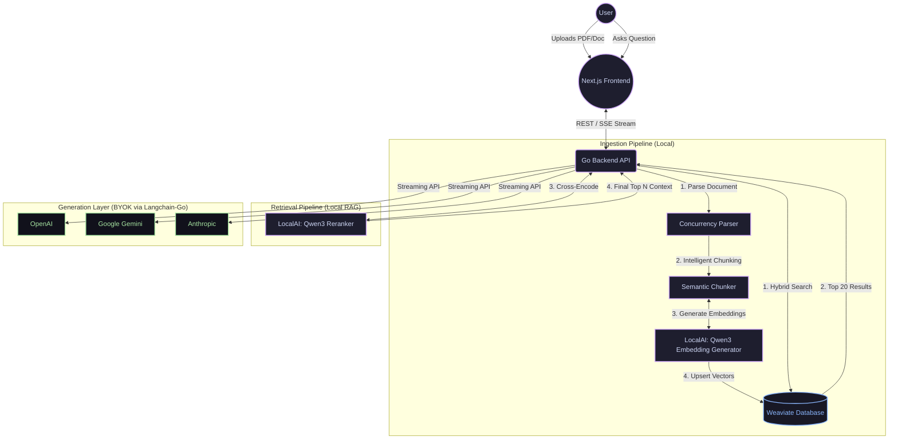

# 🐀 GopherNotebook

<div align="center">
  <p><strong>Source-grounded RAG workspaces powered by blazingly fast Golang and local AI infrastructure.</strong></p>
</div>

GopherNotebook is an open-source, commercial-grade document intelligence platform. Stop sending your sensitive PDFs and private corporate reports to the public cloud for processing. GopherNotebook keeps your embeddings and searches 100% local, utilizing **Weaviate** and state-of-the-art **Qwen3** local models to guarantee zero data leakage during the memory generation process. 

You control the final generation—seamlessly bring your own API key for OpenAI, Google Gemini, or Anthropic.

---

## ✨ Key Features
- **100% Local RAG Embeddings**: Your files never leave your machine during ingestion. Embeddings and reranking run entirely via local Weaviate and LocalAI models.
- **Blazing Fast Golang**: Built on Go, the backend handles large document chunking and concurrent hybrid searches at sub-millisecond latencies.
- **Hybrid Search & Local Reranking**: Combines dense vector matching with BM25 keyword search, then refines results using a powerful cross-encoder reranker (Qwen3).
- **Bring Your Own LLM (BYOK)**: Plug in your API keys for OpenAI (GPT-4o), Anthropic (Claude 3.7), or Google Gemini. Swap seamlessly from the UI with full streaming support.
- **Granular Citations**: Never question the AI. Every claim includes embedded citations linking directly to the source document and exact page number.
- **Isolated Workspaces**: Group related documents into 'Notebooks'. Create distinct mental contexts for distinct projects without cross-contamination.

---

## 🏗 System Architecture

GopherNotebook utilizes a true, two-stage Retrieval-Augmented Generation (RAG) architecture.



### The Architecture Breakdown
1. **Frontend**: A highly optimized Next.js 14+ application leveraging React Server Components, local storage state persistence, and Framer Motion glassmorphism for a premium UI experience.
2. **Backend**: Written in Golang. Responsible for ingesting files, chunking structural text, coordinating vector database transactions, and managing the active websocket/SSE streams.
3. **Database**: Weaviate containerized instance handling concurrent hybrid searches (Dense Vector + BM25 Lexical).
4. **LocalAI**: Bootstraps the Qwen3 (`Q4_K_M`) GGUF embedding and reranking models onto CPU/GPU safely, running alongside the application.

---

## 🚀 Quick Start Guide

We have created an all-in-one setup script that makes deploying GopherNotebook completely effortless. It automatically downloads the required local LLM weights, checks your dependencies, and spins up the system.

### Prerequisites
- [Docker](https://docs.docker.com/get-docker/) & Docker Compose
- [Golang 1.25+](https://go.dev/dl/)
- [Node.js (npm)](https://nodejs.org/)

### Installation & Run
1. **Clone the repository:**
   ```bash
   git clone https://github.com/RobinMillford/GopherNotebook.git
   cd GopherNotebook
   ```

2. **Execute the launch script:**
   ```bash
   ./start.sh
   # On first launch, the script will automatically download the required ~1.5GB Qwen3 models.
   # It will then install NPM dependencies, boot Docker Compose, and launch the web servers.
   ```

3. **Access the Application:**
   Open your browser and navigate to: [http://localhost:3000](http://localhost:3000)

4. **Shutdown:**
   To safely terminate the backend, frontend, and Docker instances, press `Ctrl+C` inside the terminal where you ran `./start.sh`.

---

## ⚙️ How to use Notebooks
1. **Create a Notebook**: Think of a 'Notebook' as a specific digital brain for a specific task (e.g., "Q3 Financial Analysis" or "Legal Case File A").
2. **Upload Documents**: Click into the Notebook and drag/drop your PDFs, Word Docs, or text files. The Go backend will chunk and embed them locally.
3. **Add your LLM Key**: Click "LLM Settings" on the left sidebar. Choose your provider (OpenAI, Gemini, Anthropic), put in your API key, and select the model (e.g., `gpt-4o`). Your API Key is **never** saved to a server—it is stored exclusively in your local browser storage per session.
4. **Ask Questions**: Ask anything! The engine will retrieve the most statistically relevant semantic passages across all documents in that notebook, cross-reference them, and generate a highly accurate, cited response.

---

## 🛡 Security & Privacy
GopherNotebook is designed for paranoid operation environments.
- **Data Ingestion**: Your files are chunked and vectorized locally. Weaviate and the embedding process have no access to the internet.
- **Provider Passthrough**: We use `langchain-go` to connect entirely statelessly to OpenAI/Gemini/Anthropic. API limits, safety protocols, and privacy policies rest entirely within your configured vendor parameters without man-in-the-middle tracking.

---

## 🤝 Contributing
Contributions are actively welcomed! Whether it is adding new document parsers to the Golang core, implementing new UI features in Tailwind, or optimizing the Docker infrastructure.
1. Fork the Project
2. Create your Feature Branch (`git checkout -b feature/AmazingFeature`)
3. Commit your Changes (`git commit -m 'Add some AmazingFeature'`)
4. Push to the Branch (`git origin feature/AmazingFeature`)
5. Open a Pull Request

---

## 📄 License
Distributed under the MIT License. See `LICENSE` for more information.
