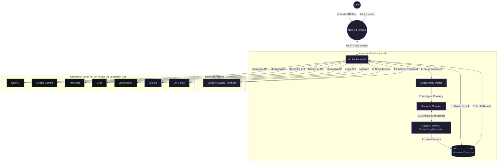

# 🐀 GopherNotebook

<div align="center">
  <p><strong>Source-grounded RAG workspaces powered by blazingly fast Golang and local AI infrastructure.</strong></p>
</div>

GopherNotebook is an open-source, commercial-grade document intelligence platform. Stop sending your sensitive PDFs and private corporate reports to the public cloud for processing. GopherNotebook keeps your embeddings and searches 100% local, utilizing **Weaviate** and state-of-the-art **Qwen3** local models to guarantee zero data leakage during the memory generation process.

You control the final generation — bring your own API key for **OpenAI, Google Gemini, Anthropic, Groq, or OpenRouter**, or run **100% local open-source models** using **Ollama or LM Studio**.

---

## ✨ Key Features
- **100% Local RAG Embeddings**: Your files never leave your machine during ingestion. Embeddings and reranking run entirely via local Weaviate and LocalAI models.
- **Blazing Fast Golang**: Built on Go, the backend handles large document chunking and concurrent hybrid searches at sub-millisecond latencies.
- **Hybrid Search & Local Reranking**: Combines dense vector matching with BM25 keyword search, then refines results using a powerful cross-encoder reranker (Qwen3).
- **7 LLM Providers (BYOK or Local)**: Plug in API keys for OpenAI, Anthropic, Google Gemini, Groq, or OpenRouter. Or use **Ollama / LM Studio** for completely local, free, offline chat generation.
- **Live Model Discovery**: When you enter an API key, the app automatically fetches the **real-time list of available models** directly from the provider — always up to date, no hardcoded lists.
- **Model Search**: Instantly filter hundreds of models (especially useful for OpenRouter) with the built-in search bar inside the settings panel.
- **Granular Citations**: Never question the AI. Every claim includes embedded citations linking directly to the source document and exact page number.
- **Isolated Workspaces**: Group related documents into 'Notebooks'. Create distinct mental contexts for distinct projects without cross-contamination.

---

## 🏗 System Architecture

GopherNotebook utilizes a true, two-stage Retrieval-Augmented Generation (RAG) architecture.



### The Architecture Breakdown
1. **Frontend**: A highly optimized Next.js 14+ application leveraging React Server Components, local storage state persistence, and Framer Motion glassmorphism for a premium UI experience.
2. **Backend**: Written in Golang. Responsible for ingesting files, chunking structural text, coordinating vector database transactions, and managing the active websocket/SSE streams.
3. **Database**: Weaviate containerized instance handling concurrent hybrid searches (Dense Vector + BM25 Lexical).
4. **LocalAI**: Bootstraps the Qwen3 (`Q4_K_M`) GGUF embedding and reranking models onto CPU/GPU safely, running alongside the application.

---

## 🤖 Supported LLM Providers

| Provider | How to get a key | Notes |
|---|---|---|
| **Ollama** | [ollama.com](https://ollama.com) | **100% Local.** Auto-starts with `start.sh`. Run `ollama pull llama3.2` to get a model. |
| **LM Studio** | [lmstudio.ai](https://lmstudio.ai/) | **100% Local.** GUI-based model runner. Start the "Local Server" inside the app. |
| **OpenAI** | [platform.openai.com](https://platform.openai.com/api-keys) | GPT-4o, o1, and more. Live model fetch. |
| **Google Gemini** | [aistudio.google.com](https://aistudio.google.com/app/apikey) | Gemini 2.5 Flash, 2.0 Flash, 1.5 Pro. Live model fetch. |
| **Anthropic** | [console.anthropic.com](https://console.anthropic.com/) | Claude 3.7, 3.5 Sonnet/Haiku. Live model fetch. |
| **Groq** | [console.groq.com](https://console.groq.com/keys) | Llama 3.x, Gemma 2, Mixtral. Ultra-fast inference. Live model fetch. |
| **OpenRouter** | [openrouter.ai/keys](https://openrouter.ai/keys) | 300+ models from all providers. Live model fetch + search. |

> **Tip:** For OpenRouter, use the built-in model search bar — it has hundreds of available models sorted by newest first.

---

## 🚀 Quick Start Guide

We have created an all-in-one setup script that makes deploying GopherNotebook completely effortless. It automatically downloads the required local LLM weights, checks your dependencies, and spins up the system.

### Prerequisites
- [Docker](https://docs.docker.com/get-docker/) & Docker Compose
- [Golang 1.22+](https://go.dev/dl/)
- [Node.js (npm)](https://nodejs.org/)

### Installation & Run
1. **Clone the repository:**
   ```bash
   git clone https://github.com/RobinMillford/GopherNotebook.git
   cd GopherNotebook
   ```

2. **Execute the launch script:**
   ```bash
   ./start.sh
   # On first launch, the script will automatically download the required ~1.5GB Qwen3 models.
   # It will then install NPM dependencies, boot Docker Compose, and launch the web servers.
   ```

3. **Access the Application:**
   Open your browser and navigate to: [http://localhost:3000](http://localhost:3000)

4. **Shutdown:**
   To safely terminate the backend, frontend, and Docker instances, press `Ctrl+C` inside the terminal where you ran `./start.sh`.

---

## ⚙️ How to use Notebooks
1. **Create a Notebook**: Think of a 'Notebook' as a specific digital brain for a specific task (e.g., "Q3 Financial Analysis" or "Legal Case File A").
2. **Upload Documents**: Click into the Notebook and drag/drop your PDFs, Word Docs, or text files. The Go backend will chunk and embed them locally.
3. **Configure your LLM**: Click **LLM Settings** in the left sidebar.
   - Pick a **provider** using the pill buttons. Choose a cloud provider (OpenAI, Gemini) OR a local provider (Ollama, LM Studio).
   - If using a cloud provider, paste your **API key** — the app will auto-fetch available models instantly.
   - If using a local provider, the app will automatically ping your local server and show a 🟢 banner if it's connected successfully.
   - **Search and select a model** from the live list.
   - Your API key is **never** sent to our servers — it lives exclusively in your local browser storage.
4. **Ask Questions**: Ask anything! The engine retrieves the most semantically relevant passages from your documents, cross-references them, and generates a cited response streamed back in real-time.

---

## 🛡 Security & Privacy
GopherNotebook is designed for paranoid operation environments.
- **Data Ingestion**: Your files are chunked and vectorized locally. Weaviate and the embedding process have no access to the internet.
- **API Keys**: Keys are stored in your browser's `localStorage` only. They are sent directly to the LLM provider per-request via your browser — the GopherNotebook backend never stores or logs them.
- **Provider Passthrough**: We use `langchain-go` to connect entirely statelessly to LLM providers. API limits, safety protocols, and privacy policies rest entirely within your configured vendor parameters.

---

## 📋 Changelog

### Latest Updates
- **100% Local LLM Generation**: Added fully offline support for **Ollama** and **LM Studio**. Chat with Llama 3.2, Qwen2.5, DeepSeek, and more directly on your machine.
- **Ollama Auto-Start**: The `start.sh` script now automatically runs `ollama serve` in the background if it detects Ollama is installed.
- **Groq support**: Full streaming chat via Groq's ultra-fast inference API (Llama 3.3, Gemma 2, Mixtral).
- **OpenRouter support**: Access 300+ models from a single API key with live model discovery.
- **Live model fetching**: All 5 providers now fetch real-time model lists when you enter your API key — no more stale hardcoded lists.
- **Redesigned LLM Settings UI**: Card-based model picker with clear selection highlighting, provider pills, API key show/hide toggle, and a live active-config summary footer.
- **Model search**: Filter models instantly by name or ID directly inside the settings panel.
- **Persistent settings**: API key, provider, and model selection are auto-saved to browser storage on dialog close.
- **Startup reliability**: `start.sh` now frees ports 8090 and 3000 before launching to prevent address-in-use crashes on restart.
- **Hydration fix**: Added `suppressHydrationWarning` to resolve React hydration mismatch caused by browser extensions (e.g. LanguageTool).

---

## 🤝 Contributing
Contributions are actively welcomed! Whether it is adding new document parsers to the Golang core, implementing new UI features, or optimizing the Docker infrastructure.
1. Fork the Project
2. Create your Feature Branch (`git checkout -b feature/AmazingFeature`)
3. Commit your Changes (`git commit -m 'Add some AmazingFeature'`)
4. Push to the Branch (`git push origin feature/AmazingFeature`)
5. Open a Pull Request

---

## 📄 License
Distributed under the MIT License. See `LICENSE` for more information.
